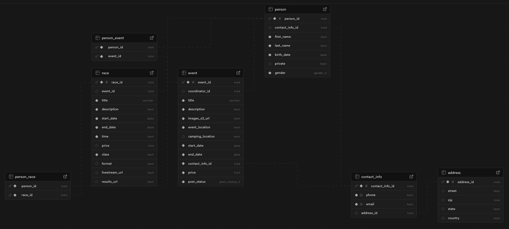

### Downhill Events DB + AI SQL
> The purpose of this database is to track global events in the downhill category.
> 
> (By Downhill, we mean: Street Luge, Skateboarding, Roller Blading, etc.)
> If you are still confused by what that means and would like to know, [here are some examples](https://www.youtube.com/@blakemcghie).

___
##### Database Schema:


___
## Evaluation
#### Example Query that worked:
- How many people outside of TX use this tool?
```sql
SELECT COUNT(*) AS num_people_outside_tx
FROM public.person p
JOIN public.contact_info ci ON p.contact_info_id = ci.contact_info_id
JOIN public.address a ON ci.address_id = a.address_id
WHERE a.state <> 'TX';
```
```
queryRawResponse = [(9,)]
The response indicates that there are 9 people outside of Texas using this tool.
```

> The only queries that had 'failing' data returns were due to me not having enough test data to perform complex queries.
> With so many foreign keys it got pretty tedious trying to add more data, and for some reason ChatGPT
> would not generate me any more data no matter what I tried.

___

LLM Querying/Training Strategies:
- I only used single-shot queries due to running out of time and energy to implement any other strategies.
    - Therefore I have not yet witnessed a difference in performance between different prompting strategies.
- I may go back tomorrow to do it but the deadline will have passed. 

